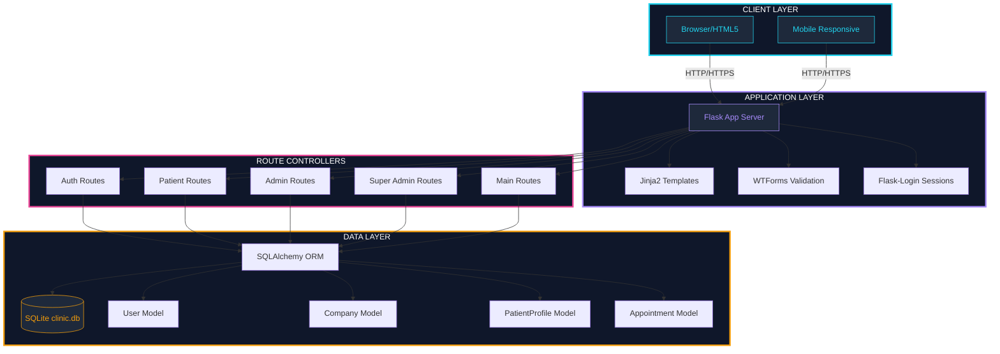
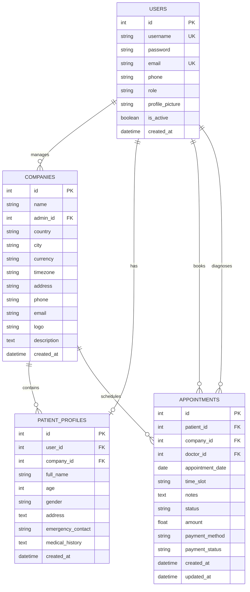
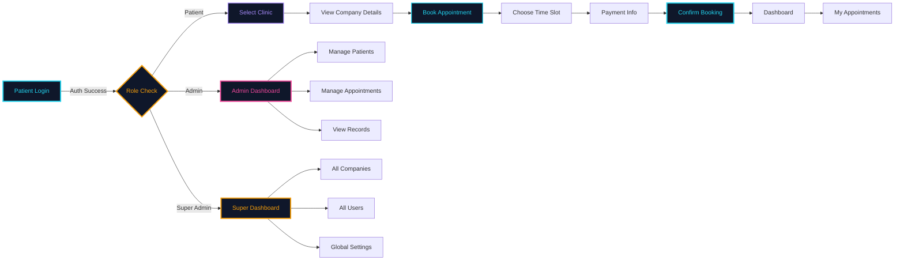
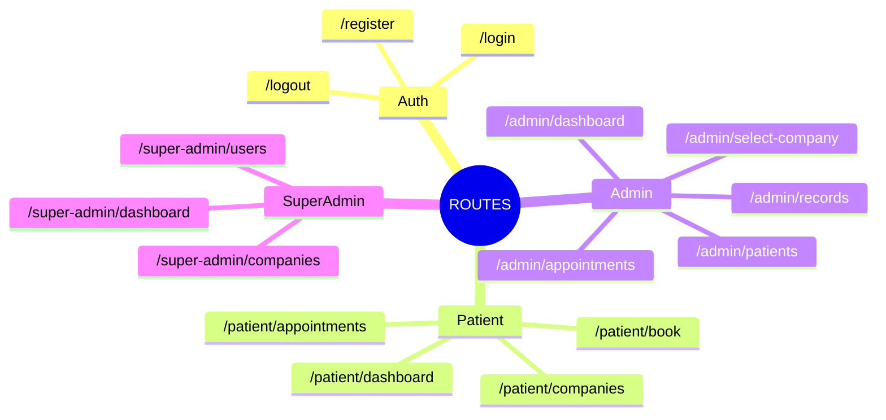

<div align="center">

<svg width="100%" height="280" viewBox="0 0 1200 280" xmlns="http://www.w3.org/2000/svg">
  <defs>
    <linearGradient id="grad1" x1="0%" y1="0%" x2="100%" y2="100%">
      <stop offset="0%" style="stop-color:#0f172a;stop-opacity:1" />
      <stop offset="50%" style="stop-color:#1e293b;stop-opacity:1" />
      <stop offset="100%" style="stop-color:#0f172a;stop-opacity:1" />
    </linearGradient>
    <linearGradient id="grad2" x1="0%" y1="0%" x2="100%" y2="0%">
      <stop offset="0%" style="stop-color:#06b6d4;stop-opacity:1" />
      <stop offset="50%" style="stop-color:#8b5cf6;stop-opacity:1" />
      <stop offset="100%" style="stop-color:#ec4899;stop-opacity:1" />
    </linearGradient>
    <filter id="glow" x="-50%" y="-50%" width="200%" height="200%">
      <feGaussianBlur stdDeviation="4" result="coloredBlur"/>
      <feMerge>
        <feMergeNode in="coloredBlur"/>
        <feMergeNode in="SourceGraphic"/>
      </feMerge>
    </filter>
  </defs>
  <rect width="100%" height="100%" fill="url(#grad1)" rx="20"/>
  <g opacity="0.1">
    <line x1="0" y1="70" x2="1200" y2="70" stroke="#22d3ee" stroke-width="1" stroke-dasharray="10" stroke-dashoffset="0">
      <animate attributeName="stroke-dashoffset" from="0" to="-20" dur="1s" repeatCount="indefinite"/>
    </line>
    <line x1="0" y1="140" x2="1200" y2="140" stroke="#a78bfa" stroke-width="1" stroke-dasharray="10" stroke-dashoffset="0">
      <animate attributeName="stroke-dashoffset" from="0" to="-20" dur="1s" repeatCount="indefinite"/>
    </line>
    <line x1="0" y1="210" x2="1200" y2="210" stroke="#ec4899" stroke-width="1" stroke-dasharray="10" stroke-dashoffset="0">
      <animate attributeName="stroke-dashoffset" from="0" to="-20" dur="1s" repeatCount="indefinite"/>
    </line>
  </g>
  <g opacity="0.3">
    <circle cx="100" cy="50" r="3" fill="#22d3ee">
      <animate attributeName="r" values="3;6;3" dur="2s" repeatCount="indefinite"/>
      <animate attributeName="opacity" values="0.4;1;0.4" dur="2s" repeatCount="indefinite"/>
    </circle>
    <circle cx="250" cy="80" r="4" fill="#a78bfa">
      <animate attributeName="r" values="4;7;4" dur="2s" begin="0.3s" repeatCount="indefinite"/>
      <animate attributeName="opacity" values="0.4;1;0.4" dur="2s" begin="0.3s" repeatCount="indefinite"/>
    </circle>
    <circle cx="180" cy="200" r="3" fill="#ec4899">
      <animate attributeName="r" values="3;6;3" dur="2s" begin="0.6s" repeatCount="indefinite"/>
      <animate attributeName="opacity" values="0.4;1;0.4" dur="2s" begin="0.6s" repeatCount="indefinite"/>
    </circle>
    <circle cx="350" cy="150" r="4" fill="#22d3ee">
      <animate attributeName="r" values="4;7;4" dur="2s" begin="0.9s" repeatCount="indefinite"/>
      <animate attributeName="opacity" values="0.4;1;0.4" dur="2s" begin="0.9s" repeatCount="indefinite"/>
    </circle>
    <circle cx="900" cy="60" r="3" fill="#a78bfa">
      <animate attributeName="r" values="3;6;3" dur="2s" begin="1.2s" repeatCount="indefinite"/>
      <animate attributeName="opacity" values="0.4;1;0.4" dur="2s" begin="1.2s" repeatCount="indefinite"/>
    </circle>
    <circle cx="1050" cy="120" r="4" fill="#ec4899">
      <animate attributeName="r" values="4;7;4" dur="2s" begin="1.5s" repeatCount="indefinite"/>
      <animate attributeName="opacity" values="0.4;1;0.4" dur="2s" begin="1.5s" repeatCount="indefinite"/>
    </circle>
    <circle cx="980" cy="220" r="3" fill="#22d3ee">
      <animate attributeName="r" values="3;6;3" dur="2s" begin="1.8s" repeatCount="indefinite"/>
      <animate attributeName="opacity" values="0.4;1;0.4" dur="2s" begin="1.8s" repeatCount="indefinite"/>
    </circle>
    <circle cx="1100" cy="180" r="4" fill="#a78bfa">
      <animate attributeName="r" values="4;7;4" dur="2s" begin="2.1s" repeatCount="indefinite"/>
      <animate attributeName="opacity" values="0.4;1;0.4" dur="2s" begin="2.1s" repeatCount="indefinite"/>
    </circle>
    <line x1="100" y1="50" x2="250" y2="80" stroke="#22d3ee" stroke-width="0.5" opacity="0.5" stroke-dasharray="5" stroke-dashoffset="0">
      <animate attributeName="stroke-dashoffset" from="0" to="-10" dur="1s" repeatCount="indefinite"/>
    </line>
    <line x1="250" y1="80" x2="350" y2="150" stroke="#a78bfa" stroke-width="0.5" opacity="0.5" stroke-dasharray="5" stroke-dashoffset="0">
      <animate attributeName="stroke-dashoffset" from="0" to="-10" dur="1s" repeatCount="indefinite"/>
    </line>
    <line x1="180" y1="200" x2="350" y2="150" stroke="#ec4899" stroke-width="0.5" opacity="0.5" stroke-dasharray="5" stroke-dashoffset="0">
      <animate attributeName="stroke-dashoffset" from="0" to="-10" dur="1s" repeatCount="indefinite"/>
    </line>
    <line x1="900" y1="60" x2="1050" y2="120" stroke="#22d3ee" stroke-width="0.5" opacity="0.5" stroke-dasharray="5" stroke-dashoffset="0">
      <animate attributeName="stroke-dashoffset" from="0" to="-10" dur="1s" repeatCount="indefinite"/>
    </line>
    <line x1="1050" y1="120" x2="980" y2="220" stroke="#a78bfa" stroke-width="0.5" opacity="0.5" stroke-dasharray="5" stroke-dashoffset="0">
      <animate attributeName="stroke-dashoffset" from="0" to="-10" dur="1s" repeatCount="indefinite"/>
    </line>
    <line x1="980" y1="220" x2="1100" y2="180" stroke="#ec4899" stroke-width="0.5" opacity="0.5" stroke-dasharray="5" stroke-dashoffset="0">
      <animate attributeName="stroke-dashoffset" from="0" to="-10" dur="1s" repeatCount="indefinite"/>
    </line>
  </g>
  <g transform="translate(600, 140)">
    <circle r="50" fill="none" stroke="url(#grad2)" stroke-width="3" filter="url(#glow)" opacity="0.8"/>
    <circle r="35" fill="none" stroke="#22d3ee" stroke-width="2" opacity="0.6">
      <animateTransform attributeName="transform" type="rotate" from="0" to="360" dur="8s" repeatCount="indefinite"/>
    </circle>
    <circle r="20" fill="url(#grad2)" opacity="0.3"/>
    <text x="0" y="8" text-anchor="middle" fill="#fff" font-size="24" font-weight="bold" font-family="monospace">&#9885;</text>
    <circle r="4" fill="#22d3ee">
      <animateMotion dur="4s" repeatCount="indefinite" path="M 50,0 A 50,50 0 1,1 50,0.1"/>
    </circle>
    <circle r="3" fill="#ec4899">
      <animateMotion dur="3s" repeatCount="indefinite" path="M 0,50 A 50,50 0 1,1 0.1,50"/>
    </circle>
  </g>
  <text x="600" y="60" text-anchor="middle" fill="url(#grad2)" font-size="42" font-weight="bold" font-family="Segoe UI, sans-serif" filter="url(#glow)">CLINIC MANAGEMENT SYSTEM</text>
  <text x="600" y="95" text-anchor="middle" fill="#94a3b8" font-size="18" font-family="Segoe UI, sans-serif">Multi-Tenant Neural Architecture</text>
  <line x1="400" y1="110" x2="800" y2="110" stroke="url(#grad2)" stroke-width="3" stroke-linecap="round" filter="url(#glow)">
    <animate attributeName="x2" values="400;800;400" dur="3s" repeatCount="indefinite"/>
  </line>
  <g transform="translate(0, 240)">
    <text x="300" y="0" text-anchor="middle" fill="#22d3ee" font-size="14" font-family="monospace">&#9673; Multi-Tenant</text>
    <text x="600" y="0" text-anchor="middle" fill="#a78bfa" font-size="14" font-family="monospace">&#9673; Role-Based</text>
    <text x="900" y="0" text-anchor="middle" fill="#ec4899" font-size="14" font-family="monospace">&#9673; Real-Time</text>
  </g>
</svg>

<p align="center">
  
</p>

<p align="center">
  
  
  
  
</p>

</div>

---

## Quick Installation

```bash
# 1. Clone the repository
git clone <repository-url>
cd clinic-management

# 2. Create virtual environment
python -m venv venv

# 3. Activate environment
# Windows:
venv\Scriptsctivate
# macOS/Linux:
source venv/bin/activate

# 4. Install dependencies
pip install -r requirements.txt

# 5. Initialize database (auto-creates instance/clinic.db)
python -c "from app import create_app; from app.extensions import db; app = create_app(); app.app_context().push(); db.create_all()"

# 6. Run the application
python run.py
```

**Access the application:**
- **Web App:** `http://localhost:5000`
- **Login:** Use your configured credentials

---

## Project Overview

<div align="center">

<svg width="100%" height="120" viewBox="0 0 1200 120" xmlns="http://www.w3.org/2000/svg">
  <defs>
    <linearGradient id="ovGrad" x1="0%" y1="0%" x2="100%" y2="0%">
      <stop offset="0%" style="stop-color:#0f172a"/>
      <stop offset="100%" style="stop-color:#1e293b"/>
    </linearGradient>
  </defs>
  <rect width="100%" height="100%" fill="url(#ovGrad)" rx="12"/>
  <g transform="translate(100, 60)">
    <rect x="-40" y="-30" width="80" height="60" rx="10" fill="#22d3ee" opacity="0.2" stroke="#22d3ee" stroke-width="2"/>
    <text x="0" y="5" text-anchor="middle" fill="#22d3ee" font-size="12" font-family="monospace">PATIENT</text>
    <circle cx="50" cy="0" r="3" fill="#22d3ee">
      <animate attributeName="opacity" values="0.3;1;0.3" dur="2s" repeatCount="indefinite"/>
    </circle>
    <line x1="50" y1="0" x2="150" y2="0" stroke="#22d3ee" stroke-width="2" stroke-dasharray="5,5" stroke-dashoffset="0">
      <animate attributeName="stroke-dashoffset" from="0" to="-10" dur="1s" repeatCount="indefinite"/>
    </line>
  </g>
  <g transform="translate(350, 60)">
    <rect x="-40" y="-30" width="80" height="60" rx="10" fill="#a78bfa" opacity="0.2" stroke="#a78bfa" stroke-width="2"/>
    <text x="0" y="5" text-anchor="middle" fill="#a78bfa" font-size="12" font-family="monospace">CLINIC</text>
    <circle cx="50" cy="0" r="3" fill="#a78bfa">
      <animate attributeName="opacity" values="0.3;1;0.3" dur="2s" begin="0.5s" repeatCount="indefinite"/>
    </circle>
    <line x1="50" y1="0" x2="150" y2="0" stroke="#a78bfa" stroke-width="2" stroke-dasharray="5,5" stroke-dashoffset="0">
      <animate attributeName="stroke-dashoffset" from="0" to="-10" dur="1s" repeatCount="indefinite"/>
    </line>
  </g>
  <g transform="translate(600, 60)">
    <rect x="-40" y="-30" width="80" height="60" rx="10" fill="#ec4899" opacity="0.2" stroke="#ec4899" stroke-width="2"/>
    <text x="0" y="5" text-anchor="middle" fill="#ec4899" font-size="12" font-family="monospace">ADMIN</text>
    <circle cx="50" cy="0" r="3" fill="#ec4899">
      <animate attributeName="opacity" values="0.3;1;0.3" dur="2s" begin="1s" repeatCount="indefinite"/>
    </circle>
    <line x1="50" y1="0" x2="150" y2="0" stroke="#ec4899" stroke-width="2" stroke-dasharray="5,5" stroke-dashoffset="0">
      <animate attributeName="stroke-dashoffset" from="0" to="-10" dur="1s" repeatCount="indefinite"/>
    </line>
  </g>
  <g transform="translate(850, 60)">
    <rect x="-50" y="-30" width="100" height="60" rx="10" fill="#f59e0b" opacity="0.2" stroke="#f59e0b" stroke-width="2"/>
    <text x="0" y="5" text-anchor="middle" fill="#f59e0b" font-size="12" font-family="monospace">SUPER ADMIN</text>
    <circle cx="60" cy="0" r="3" fill="#f59e0b">
      <animate attributeName="opacity" values="0.3;1;0.3" dur="2s" begin="1.5s" repeatCount="indefinite"/>
    </circle>
  </g>
</svg>

</div>

A **multi-tenant clinic management platform** built with Flask and SQLite. Features role-based access control, appointment scheduling, patient management, and company-level data isolation. Designed for healthcare providers managing multiple clinics under a single unified platform.

---

## System Architecture

<div align="center">



</div>

---

## Neural Workflow Engine

<div align="center">

<svg width="100%" height="500" viewBox="0 0 1000 500" xmlns="http://www.w3.org/2000/svg">
  <defs>
    <linearGradient id="nGrad1" x1="0%" y1="0%" x2="100%" y2="100%">
      <stop offset="0%" style="stop-color:#0f172a"/>
      <stop offset="100%" style="stop-color:#1e293b"/>
    </linearGradient>
    <radialGradient id="nodeGlow" cx="50%" cy="50%" r="50%">
      <stop offset="0%" style="stop-color:#22d3ee;stop-opacity:0.8"/>
      <stop offset="100%" style="stop-color:#22d3ee;stop-opacity:0"/>
    </radialGradient>
    <radialGradient id="nodeGlow2" cx="50%" cy="50%" r="50%">
      <stop offset="0%" style="stop-color:#a78bfa;stop-opacity:0.8"/>
      <stop offset="100%" style="stop-color:#a78bfa;stop-opacity:0"/>
    </radialGradient>
    <radialGradient id="nodeGlow3" cx="50%" cy="50%" r="50%">
      <stop offset="0%" style="stop-color:#ec4899;stop-opacity:0.8"/>
      <stop offset="100%" style="stop-color:#ec4899;stop-opacity:0"/>
    </radialGradient>
  </defs>
  <rect width="100%" height="100%" fill="url(#nGrad1)" rx="16"/>
  <text x="500" y="40" fill="#22d3ee" font-family="Segoe UI" font-size="24" font-weight="bold" text-anchor="middle" filter="drop-shadow(0 0 8px #22d3ee)">NEURAL WORKFLOW ENGINE</text>
  <text x="100" y="80" fill="#94a3b8" font-family="monospace" font-size="10" text-anchor="middle">INPUT LAYER</text>
  <text x="350" y="80" fill="#94a3b8" font-family="monospace" font-size="10" text-anchor="middle">HIDDEN LAYER 1</text>
  <text x="600" y="80" fill="#94a3b8" font-family="monospace" font-size="10" text-anchor="middle">HIDDEN LAYER 2</text>
  <text x="850" y="80" fill="#94a3b8" font-family="monospace" font-size="10" text-anchor="middle">OUTPUT LAYER</text>

  <g transform="translate(100, 130)">
    <circle r="8" fill="#22d3ee">
      <animate attributeName="r" values="8;12;8" dur="2s" repeatCount="indefinite"/>
      <animate attributeName="opacity" values="0.8;1;0.8" dur="2s" repeatCount="indefinite"/>
    </circle>
    <circle r="20" fill="url(#nodeGlow)">
      <animate attributeName="r" values="20;24;20" dur="2s" repeatCount="indefinite"/>
      <animate attributeName="opacity" values="0.8;1;0.8" dur="2s" repeatCount="indefinite"/>
    </circle>
    <text y="35" fill="#e2e8f0" font-family="Segoe UI" font-size="11" font-weight="600" text-anchor="middle">Auth Request</text>
  </g>
  <g transform="translate(100, 220)">
    <circle r="8" fill="#22d3ee">
      <animate attributeName="r" values="8;12;8" dur="2s" begin="0.3s" repeatCount="indefinite"/>
      <animate attributeName="opacity" values="0.8;1;0.8" dur="2s" begin="0.3s" repeatCount="indefinite"/>
    </circle>
    <circle r="20" fill="url(#nodeGlow)">
      <animate attributeName="r" values="20;24;20" dur="2s" begin="0.3s" repeatCount="indefinite"/>
      <animate attributeName="opacity" values="0.8;1;0.8" dur="2s" begin="0.3s" repeatCount="indefinite"/>
    </circle>
    <text y="35" fill="#e2e8f0" font-family="Segoe UI" font-size="11" font-weight="600" text-anchor="middle">Form Data</text>
  </g>
  <g transform="translate(100, 310)">
    <circle r="8" fill="#22d3ee">
      <animate attributeName="r" values="8;12;8" dur="2s" begin="0.6s" repeatCount="indefinite"/>
      <animate attributeName="opacity" values="0.8;1;0.8" dur="2s" begin="0.6s" repeatCount="indefinite"/>
    </circle>
    <circle r="20" fill="url(#nodeGlow)">
      <animate attributeName="r" values="20;24;20" dur="2s" begin="0.6s" repeatCount="indefinite"/>
      <animate attributeName="opacity" values="0.8;1;0.8" dur="2s" begin="0.6s" repeatCount="indefinite"/>
    </circle>
    <text y="35" fill="#e2e8f0" font-family="Segoe UI" font-size="11" font-weight="600" text-anchor="middle">File Upload</text>
  </g>
  <g transform="translate(100, 400)">
    <circle r="8" fill="#22d3ee">
      <animate attributeName="r" values="8;12;8" dur="2s" begin="0.9s" repeatCount="indefinite"/>
      <animate attributeName="opacity" values="0.8;1;0.8" dur="2s" begin="0.9s" repeatCount="indefinite"/>
    </circle>
    <circle r="20" fill="url(#nodeGlow)">
      <animate attributeName="r" values="20;24;20" dur="2s" begin="0.9s" repeatCount="indefinite"/>
      <animate attributeName="opacity" values="0.8;1;0.8" dur="2s" begin="0.9s" repeatCount="indefinite"/>
    </circle>
    <text y="35" fill="#e2e8f0" font-family="Segoe UI" font-size="11" font-weight="600" text-anchor="middle">API Call</text>
  </g>

  <g transform="translate(350, 130)">
    <circle r="8" fill="#a78bfa">
      <animate attributeName="r" values="8;12;8" dur="2s" begin="0.2s" repeatCount="indefinite"/>
      <animate attributeName="opacity" values="0.8;1;0.8" dur="2s" begin="0.2s" repeatCount="indefinite"/>
    </circle>
    <circle r="20" fill="url(#nodeGlow2)">
      <animate attributeName="r" values="20;24;20" dur="2s" begin="0.2s" repeatCount="indefinite"/>
      <animate attributeName="opacity" values="0.8;1;0.8" dur="2s" begin="0.2s" repeatCount="indefinite"/>
    </circle>
    <text y="35" fill="#e2e8f0" font-family="Segoe UI" font-size="11" font-weight="600" text-anchor="middle">Validation</text>
  </g>
  <g transform="translate(350, 220)">
    <circle r="8" fill="#a78bfa">
      <animate attributeName="r" values="8;12;8" dur="2s" begin="0.5s" repeatCount="indefinite"/>
      <animate attributeName="opacity" values="0.8;1;0.8" dur="2s" begin="0.5s" repeatCount="indefinite"/>
    </circle>
    <circle r="20" fill="url(#nodeGlow2)">
      <animate attributeName="r" values="20;24;20" dur="2s" begin="0.5s" repeatCount="indefinite"/>
      <animate attributeName="opacity" values="0.8;1;0.8" dur="2s" begin="0.5s" repeatCount="indefinite"/>
    </circle>
    <text y="35" fill="#e2e8f0" font-family="Segoe UI" font-size="11" font-weight="600" text-anchor="middle">Sanitization</text>
  </g>
  <g transform="translate(350, 310)">
    <circle r="8" fill="#a78bfa">
      <animate attributeName="r" values="8;12;8" dur="2s" begin="0.8s" repeatCount="indefinite"/>
      <animate attributeName="opacity" values="0.8;1;0.8" dur="2s" begin="0.8s" repeatCount="indefinite"/>
    </circle>
    <circle r="20" fill="url(#nodeGlow2)">
      <animate attributeName="r" values="20;24;20" dur="2s" begin="0.8s" repeatCount="indefinite"/>
      <animate attributeName="opacity" values="0.8;1;0.8" dur="2s" begin="0.8s" repeatCount="indefinite"/>
    </circle>
    <text y="35" fill="#e2e8f0" font-family="Segoe UI" font-size="11" font-weight="600" text-anchor="middle">Encryption</text>
  </g>
  <g transform="translate(350, 400)">
    <circle r="8" fill="#a78bfa">
      <animate attributeName="r" values="8;12;8" dur="2s" begin="1.1s" repeatCount="indefinite"/>
      <animate attributeName="opacity" values="0.8;1;0.8" dur="2s" begin="1.1s" repeatCount="indefinite"/>
    </circle>
    <circle r="20" fill="url(#nodeGlow2)">
      <animate attributeName="r" values="20;24;20" dur="2s" begin="1.1s" repeatCount="indefinite"/>
      <animate attributeName="opacity" values="0.8;1;0.8" dur="2s" begin="1.1s" repeatCount="indefinite"/>
    </circle>
    <text y="35" fill="#e2e8f0" font-family="Segoe UI" font-size="11" font-weight="600" text-anchor="middle">Rate Limit</text>
  </g>

  <g transform="translate(600, 160)">
    <circle r="8" fill="#ec4899">
      <animate attributeName="r" values="8;12;8" dur="2s" begin="0.4s" repeatCount="indefinite"/>
      <animate attributeName="opacity" values="0.8;1;0.8" dur="2s" begin="0.4s" repeatCount="indefinite"/>
    </circle>
    <circle r="20" fill="url(#nodeGlow3)">
      <animate attributeName="r" values="20;24;20" dur="2s" begin="0.4s" repeatCount="indefinite"/>
      <animate attributeName="opacity" values="0.8;1;0.8" dur="2s" begin="0.4s" repeatCount="indefinite"/>
    </circle>
    <text y="35" fill="#e2e8f0" font-family="Segoe UI" font-size="11" font-weight="600" text-anchor="middle">Role Check</text>
  </g>
  <g transform="translate(600, 260)">
    <circle r="8" fill="#ec4899">
      <animate attributeName="r" values="8;12;8" dur="2s" begin="0.7s" repeatCount="indefinite"/>
      <animate attributeName="opacity" values="0.8;1;0.8" dur="2s" begin="0.7s" repeatCount="indefinite"/>
    </circle>
    <circle r="20" fill="url(#nodeGlow3)">
      <animate attributeName="r" values="20;24;20" dur="2s" begin="0.7s" repeatCount="indefinite"/>
      <animate attributeName="opacity" values="0.8;1;0.8" dur="2s" begin="0.7s" repeatCount="indefinite"/>
    </circle>
    <text y="35" fill="#e2e8f0" font-family="Segoe UI" font-size="11" font-weight="600" text-anchor="middle">Tenant Filter</text>
  </g>
  <g transform="translate(600, 360)">
    <circle r="8" fill="#ec4899">
      <animate attributeName="r" values="8;12;8" dur="2s" begin="1.0s" repeatCount="indefinite"/>
      <animate attributeName="opacity" values="0.8;1;0.8" dur="2s" begin="1.0s" repeatCount="indefinite"/>
    </circle>
    <circle r="20" fill="url(#nodeGlow3)">
      <animate attributeName="r" values="20;24;20" dur="2s" begin="1.0s" repeatCount="indefinite"/>
      <animate attributeName="opacity" values="0.8;1;0.8" dur="2s" begin="1.0s" repeatCount="indefinite"/>
    </circle>
    <text y="35" fill="#e2e8f0" font-family="Segoe UI" font-size="11" font-weight="600" text-anchor="middle">Permission</text>
  </g>

  <g transform="translate(850, 200)">
    <circle r="8" fill="#f59e0b">
      <animate attributeName="r" values="8;12;8" dur="2s" begin="0.6s" repeatCount="indefinite"/>
      <animate attributeName="opacity" values="0.8;1;0.8" dur="2s" begin="0.6s" repeatCount="indefinite"/>
    </circle>
    <circle r="20" fill="url(#nodeGlow)">
      <animate attributeName="r" values="20;24;20" dur="2s" begin="0.6s" repeatCount="indefinite"/>
      <animate attributeName="opacity" values="0.8;1;0.8" dur="2s" begin="0.6s" repeatCount="indefinite"/>
    </circle>
    <text y="35" fill="#e2e8f0" font-family="Segoe UI" font-size="11" font-weight="600" text-anchor="middle">HTML Render</text>
  </g>
  <g transform="translate(850, 320)">
    <circle r="8" fill="#f59e0b">
      <animate attributeName="r" values="8;12;8" dur="2s" begin="0.9s" repeatCount="indefinite"/>
      <animate attributeName="opacity" values="0.8;1;0.8" dur="2s" begin="0.9s" repeatCount="indefinite"/>
    </circle>
    <circle r="20" fill="url(#nodeGlow)">
      <animate attributeName="r" values="20;24;20" dur="2s" begin="0.9s" repeatCount="indefinite"/>
      <animate attributeName="opacity" values="0.8;1;0.8" dur="2s" begin="0.9s" repeatCount="indefinite"/>
    </circle>
    <text y="35" fill="#e2e8f0" font-family="Segoe UI" font-size="11" font-weight="600" text-anchor="middle">JSON Response</text>
  </g>

  <line x1="108" y1="130" x2="342" y2="130" stroke="#22d3ee" stroke-width="2" fill="none" opacity="0.4" stroke-dasharray="10" stroke-dashoffset="0">
    <animate attributeName="stroke-dashoffset" from="0" to="-20" dur="1s" repeatCount="indefinite"/>
  </line>
  <line x1="108" y1="130" x2="342" y2="220" stroke="#22d3ee" stroke-width="2" fill="none" opacity="0.3" stroke-dasharray="10" stroke-dashoffset="0">
    <animate attributeName="stroke-dashoffset" from="0" to="-20" dur="1s" repeatCount="indefinite"/>
  </line>
  <line x1="108" y1="220" x2="342" y2="130" stroke="#22d3ee" stroke-width="2" fill="none" opacity="0.3" stroke-dasharray="10" stroke-dashoffset="0">
    <animate attributeName="stroke-dashoffset" from="0" to="-20" dur="1s" repeatCount="indefinite"/>
  </line>
  <line x1="108" y1="220" x2="342" y2="220" stroke="#22d3ee" stroke-width="2" fill="none" opacity="0.4" stroke-dasharray="10" stroke-dashoffset="0">
    <animate attributeName="stroke-dashoffset" from="0" to="-20" dur="1s" repeatCount="indefinite"/>
  </line>
  <line x1="108" y1="220" x2="342" y2="310" stroke="#22d3ee" stroke-width="2" fill="none" opacity="0.3" stroke-dasharray="10" stroke-dashoffset="0">
    <animate attributeName="stroke-dashoffset" from="0" to="-20" dur="1s" repeatCount="indefinite"/>
  </line>
  <line x1="108" y1="310" x2="342" y2="220" stroke="#22d3ee" stroke-width="2" fill="none" opacity="0.3" stroke-dasharray="10" stroke-dashoffset="0">
    <animate attributeName="stroke-dashoffset" from="0" to="-20" dur="1s" repeatCount="indefinite"/>
  </line>
  <line x1="108" y1="310" x2="342" y2="310" stroke="#22d3ee" stroke-width="2" fill="none" opacity="0.4" stroke-dasharray="10" stroke-dashoffset="0">
    <animate attributeName="stroke-dashoffset" from="0" to="-20" dur="1s" repeatCount="indefinite"/>
  </line>
  <line x1="108" y1="310" x2="342" y2="400" stroke="#22d3ee" stroke-width="2" fill="none" opacity="0.3" stroke-dasharray="10" stroke-dashoffset="0">
    <animate attributeName="stroke-dashoffset" from="0" to="-20" dur="1s" repeatCount="indefinite"/>
  </line>
  <line x1="108" y1="400" x2="342" y2="310" stroke="#22d3ee" stroke-width="2" fill="none" opacity="0.3" stroke-dasharray="10" stroke-dashoffset="0">
    <animate attributeName="stroke-dashoffset" from="0" to="-20" dur="1s" repeatCount="indefinite"/>
  </line>
  <line x1="108" y1="400" x2="342" y2="400" stroke="#22d3ee" stroke-width="2" fill="none" opacity="0.4" stroke-dasharray="10" stroke-dashoffset="0">
    <animate attributeName="stroke-dashoffset" from="0" to="-20" dur="1s" repeatCount="indefinite"/>
  </line>

  <line x1="358" y1="130" x2="592" y2="160" stroke="#a78bfa" stroke-width="2" fill="none" opacity="0.4" stroke-dasharray="10" stroke-dashoffset="0">
    <animate attributeName="stroke-dashoffset" from="0" to="-20" dur="1s" repeatCount="indefinite"/>
  </line>
  <line x1="358" y1="130" x2="592" y2="260" stroke="#a78bfa" stroke-width="2" fill="none" opacity="0.3" stroke-dasharray="10" stroke-dashoffset="0">
    <animate attributeName="stroke-dashoffset" from="0" to="-20" dur="1s" repeatCount="indefinite"/>
  </line>
  <line x1="358" y1="220" x2="592" y2="160" stroke="#a78bfa" stroke-width="2" fill="none" opacity="0.3" stroke-dasharray="10" stroke-dashoffset="0">
    <animate attributeName="stroke-dashoffset" from="0" to="-20" dur="1s" repeatCount="indefinite"/>
  </line>
  <line x1="358" y1="220" x2="592" y2="260" stroke="#a78bfa" stroke-width="2" fill="none" opacity="0.4" stroke-dasharray="10" stroke-dashoffset="0">
    <animate attributeName="stroke-dashoffset" from="0" to="-20" dur="1s" repeatCount="indefinite"/>
  </line>
  <line x1="358" y1="220" x2="592" y2="360" stroke="#a78bfa" stroke-width="2" fill="none" opacity="0.3" stroke-dasharray="10" stroke-dashoffset="0">
    <animate attributeName="stroke-dashoffset" from="0" to="-20" dur="1s" repeatCount="indefinite"/>
  </line>
  <line x1="358" y1="310" x2="592" y2="260" stroke="#a78bfa" stroke-width="2" fill="none" opacity="0.3" stroke-dasharray="10" stroke-dashoffset="0">
    <animate attributeName="stroke-dashoffset" from="0" to="-20" dur="1s" repeatCount="indefinite"/>
  </line>
  <line x1="358" y1="310" x2="592" y2="360" stroke="#a78bfa" stroke-width="2" fill="none" opacity="0.4" stroke-dasharray="10" stroke-dashoffset="0">
    <animate attributeName="stroke-dashoffset" from="0" to="-20" dur="1s" repeatCount="indefinite"/>
  </line>
  <line x1="358" y1="400" x2="592" y2="360" stroke="#a78bfa" stroke-width="2" fill="none" opacity="0.3" stroke-dasharray="10" stroke-dashoffset="0">
    <animate attributeName="stroke-dashoffset" from="0" to="-20" dur="1s" repeatCount="indefinite"/>
  </line>

  <line x1="608" y1="160" x2="842" y2="200" stroke="#ec4899" stroke-width="2" fill="none" opacity="0.4" stroke-dasharray="10" stroke-dashoffset="0">
    <animate attributeName="stroke-dashoffset" from="0" to="-20" dur="1s" repeatCount="indefinite"/>
  </line>
  <line x1="608" y1="160" x2="842" y2="320" stroke="#ec4899" stroke-width="2" fill="none" opacity="0.3" stroke-dasharray="10" stroke-dashoffset="0">
    <animate attributeName="stroke-dashoffset" from="0" to="-20" dur="1s" repeatCount="indefinite"/>
  </line>
  <line x1="608" y1="260" x2="842" y2="200" stroke="#ec4899" stroke-width="2" fill="none" opacity="0.3" stroke-dasharray="10" stroke-dashoffset="0">
    <animate attributeName="stroke-dashoffset" from="0" to="-20" dur="1s" repeatCount="indefinite"/>
  </line>
  <line x1="608" y1="260" x2="842" y2="320" stroke="#ec4899" stroke-width="2" fill="none" opacity="0.4" stroke-dasharray="10" stroke-dashoffset="0">
    <animate attributeName="stroke-dashoffset" from="0" to="-20" dur="1s" repeatCount="indefinite"/>
  </line>
  <line x1="608" y1="360" x2="842" y2="320" stroke="#ec4899" stroke-width="2" fill="none" opacity="0.3" stroke-dasharray="10" stroke-dashoffset="0">
    <animate attributeName="stroke-dashoffset" from="0" to="-20" dur="1s" repeatCount="indefinite"/>
  </line>

  <circle r="3" fill="#fff">
    <animateMotion dur="1.5s" repeatCount="indefinite" path="M 108,130 Q 225,130 342,130"/>
  </circle>
  <circle r="3" fill="#fff">
    <animateMotion dur="2s" repeatCount="indefinite" path="M 108,220 Q 225,275 342,310"/>
  </circle>
  <circle r="3" fill="#fff">
    <animateMotion dur="1.8s" repeatCount="indefinite" path="M 358,220 Q 475,290 592,360"/>
  </circle>
  <circle r="3" fill="#fff">
    <animateMotion dur="2.2s" repeatCount="indefinite" path="M 608,260 Q 725,260 842,200"/>
  </circle>
</svg>

</div>

---
## Database Schema (Entity Relationship)

<div align="center">



</div>

---

## User Role Flow Matrix

<div align="center">

<svg width="100%" height="400" viewBox="0 0 1000 400" xmlns="http://www.w3.org/2000/svg">
  <defs>
    <linearGradient id="rfGrad" x1="0%" y1="0%" x2="100%" y2="0%">
      <stop offset="0%" style="stop-color:#0f172a"/>
      <stop offset="100%" style="stop-color:#1e293b"/>
    </linearGradient>
  </defs>
  <rect width="100%" height="100%" fill="url(#rfGrad)" rx="16"/>

  <g transform="translate(50, 80)">
    <rect width="200" height="240" rx="12" fill="#f59e0b" opacity="0.15" stroke="#f59e0b" stroke-width="2"/>
    <text x="100" y="30" fill="#fff" font-family="Segoe UI" font-size="14" font-weight="bold" text-anchor="middle">SUPER ADMIN</text>
    <text x="20" y="60" fill="#cbd5e1" font-family="Segoe UI" font-size="11">Manage All Companies</text>
    <text x="20" y="85" fill="#cbd5e1" font-family="Segoe UI" font-size="11">View All Users</text>
    <text x="20" y="110" fill="#cbd5e1" font-family="Segoe UI" font-size="11">System Configuration</text>
    <text x="20" y="135" fill="#cbd5e1" font-family="Segoe UI" font-size="11">Global Analytics</text>
    <text x="20" y="160" fill="#cbd5e1" font-family="Segoe UI" font-size="11">Role Assignment</text>
    <text x="20" y="185" fill="#cbd5e1" font-family="Segoe UI" font-size="11">Database Access</text>
    <text x="20" y="210" fill="#cbd5e1" font-family="Segoe UI" font-size="11">Audit Logs</text>
    <circle cx="200" cy="120" r="6" fill="#f59e0b">
      <animate attributeName="opacity" values="0.6;1;0.6" dur="2s" repeatCount="indefinite"/>
    </circle>
  </g>

  <g transform="translate(350, 80)">
    <rect width="200" height="240" rx="12" fill="#ec4899" opacity="0.15" stroke="#ec4899" stroke-width="2"/>
    <text x="100" y="30" fill="#fff" font-family="Segoe UI" font-size="14" font-weight="bold" text-anchor="middle">ADMIN</text>
    <text x="20" y="60" fill="#cbd5e1" font-family="Segoe UI" font-size="11">Manage Own Company</text>
    <text x="20" y="85" fill="#cbd5e1" font-family="Segoe UI" font-size="11">View Patients</text>
    <text x="20" y="110" fill="#cbd5e1" font-family="Segoe UI" font-size="11">Manage Appointments</text>
    <text x="20" y="135" fill="#cbd5e1" font-family="Segoe UI" font-size="11">Doctor Assignment</text>
    <text x="20" y="160" fill="#cbd5e1" font-family="Segoe UI" font-size="11">Company Settings</text>
    <text x="20" y="185" fill="#cbd5e1" font-family="Segoe UI" font-size="11">Payment Tracking</text>
    <text x="20" y="210" fill="#cbd5e1" font-family="Segoe UI" font-size="11">Reports &amp; Records</text>
    <circle cx="0" cy="120" r="6" fill="#ec4899">
      <animate attributeName="opacity" values="0.6;1;0.6" dur="2s" begin="0.5s" repeatCount="indefinite"/>
    </circle>
    <circle cx="200" cy="120" r="6" fill="#ec4899">
      <animate attributeName="opacity" values="0.6;1;0.6" dur="2s" begin="0.5s" repeatCount="indefinite"/>
    </circle>
  </g>

  <g transform="translate(650, 80)">
    <rect width="200" height="240" rx="12" fill="#a78bfa" opacity="0.15" stroke="#a78bfa" stroke-width="2"/>
    <text x="100" y="30" fill="#fff" font-family="Segoe UI" font-size="14" font-weight="bold" text-anchor="middle">DOCTOR</text>
    <text x="20" y="60" fill="#cbd5e1" font-family="Segoe UI" font-size="11">View Assigned Patients</text>
    <text x="20" y="85" fill="#cbd5e1" font-family="Segoe UI" font-size="11">Update Diagnoses</text>
    <text x="20" y="110" fill="#cbd5e1" font-family="Segoe UI" font-size="11">Manage Schedule</text>
    <text x="20" y="135" fill="#cbd5e1" font-family="Segoe UI" font-size="11">Write Prescriptions</text>
    <text x="20" y="160" fill="#cbd5e1" font-family="Segoe UI" font-size="11">Medical Records</text>
    <text x="20" y="185" fill="#cbd5e1" font-family="Segoe UI" font-size="11">Appointment Notes</text>
    <text x="20" y="210" fill="#cbd5e1" font-family="Segoe UI" font-size="11">Patient History</text>
    <circle cx="0" cy="120" r="6" fill="#a78bfa">
      <animate attributeName="opacity" values="0.6;1;0.6" dur="2s" begin="1s" repeatCount="indefinite"/>
    </circle>
    <circle cx="200" cy="120" r="6" fill="#a78bfa">
      <animate attributeName="opacity" values="0.6;1;0.6" dur="2s" begin="1s" repeatCount="indefinite"/>
    </circle>
  </g>

  <g transform="translate(350, 340)">
    <rect width="300" height="40" rx="12" fill="#22d3ee" opacity="0.15" stroke="#22d3ee" stroke-width="2"/>
    <text x="150" y="25" fill="#fff" font-family="Segoe UI" font-size="14" font-weight="bold" text-anchor="middle">PATIENT</text>
    <circle cx="0" cy="20" r="6" fill="#22d3ee">
      <animate attributeName="opacity" values="0.6;1;0.6" dur="2s" begin="1.5s" repeatCount="indefinite"/>
    </circle>
  </g>

  <line x1="256" y1="200" x2="344" y2="200" stroke="#f59e0b" stroke-width="2" fill="none" stroke-dasharray="8" stroke-dashoffset="0">
    <animate attributeName="stroke-dashoffset" from="0" to="-16" dur="1s" repeatCount="indefinite"/>
  </line>
  <line x1="556" y1="200" x2="644" y2="200" stroke="#ec4899" stroke-width="2" fill="none" stroke-dasharray="8" stroke-dashoffset="0">
    <animate attributeName="stroke-dashoffset" from="0" to="-16" dur="1s" repeatCount="indefinite"/>
  </line>
  <line x1="750" y1="320" x2="500" y2="340" stroke="#a78bfa" stroke-width="2" fill="none" stroke-dasharray="8" stroke-dashoffset="0">
    <animate attributeName="stroke-dashoffset" from="0" to="-16" dur="1s" repeatCount="indefinite"/>
  </line>
  <line x1="500" y1="320" x2="500" y2="340" stroke="#22d3ee" stroke-width="2" fill="none" stroke-dasharray="8" stroke-dashoffset="0">
    <animate attributeName="stroke-dashoffset" from="0" to="-16" dur="1s" repeatCount="indefinite"/>
  </line>

  <circle r="4" fill="#fff">
    <animateMotion dur="2s" repeatCount="indefinite" path="M 256,200 L 344,200"/>
  </circle>
  <circle r="4" fill="#fff">
    <animateMotion dur="2s" repeatCount="indefinite" path="M 556,200 L 644,200"/>
  </circle>
  <circle r="4" fill="#fff">
    <animateMotion dur="2s" repeatCount="indefinite" path="M 750,320 L 500,340"/>
  </circle>
</svg>

</div>

---

## Patient Journey Flowchart

<div align="center">



</div>

---

## Security &amp; Authentication Flow

<div align="center">

<svg width="100%" height="350" viewBox="0 0 1000 350" xmlns="http://www.w3.org/2000/svg">
  <defs>
    <linearGradient id="secGrad" x1="0%" y1="0%" x2="100%" y2="0%">
      <stop offset="0%" style="stop-color:#0f172a"/>
      <stop offset="100%" style="stop-color:#1e293b"/>
    </linearGradient>
  </defs>
  <rect width="100%" height="100%" fill="url(#secGrad)" rx="16"/>
  <text x="500" y="40" fill="#22d3ee" font-family="Segoe UI" font-size="22" font-weight="bold" text-anchor="middle" filter="drop-shadow(0 0 6px #22d3ee)">SECURITY AUTHENTICATION PIPELINE</text>

  <g transform="translate(100, 200)">
    <path d="M 0,-50 L 43,-25 L 43,25 L 0,50 L -43,25 L -43,-25 Z" stroke-width="3" fill-opacity="0.1" stroke="#22d3ee" fill="#22d3ee"/>
    <text y="5" fill="#e2e8f0" font-family="Segoe UI" font-size="13" font-weight="600" text-anchor="middle">REQUEST</text>
  </g>
  <g transform="translate(300, 200)">
    <path d="M 0,-50 L 43,-25 L 43,25 L 0,50 L -43,25 L -43,-25 Z" stroke-width="3" fill-opacity="0.1" stroke="#a78bfa" fill="#a78bfa"/>
    <text y="5" fill="#e2e8f0" font-family="Segoe UI" font-size="13" font-weight="600" text-anchor="middle">VALIDATE</text>
  </g>
  <g transform="translate(500, 200)">
    <path d="M 0,-50 L 43,-25 L 43,25 L 0,50 L -43,25 L -43,-25 Z" stroke-width="3" fill-opacity="0.1" stroke="#ec4899" fill="#ec4899"/>
    <text y="5" fill="#e2e8f0" font-family="Segoe UI" font-size="13" font-weight="600" text-anchor="middle">SESSION</text>
  </g>
  <g transform="translate(700, 200)">
    <path d="M 0,-50 L 43,-25 L 43,25 L 0,50 L -43,25 L -43,-25 Z" stroke-width="3" fill-opacity="0.1" stroke="#f59e0b" fill="#f59e0b"/>
    <text y="5" fill="#e2e8f0" font-family="Segoe UI" font-size="13" font-weight="600" text-anchor="middle">ROLE CHECK</text>
  </g>
  <g transform="translate(900, 200)">
    <path d="M 0,-50 L 43,-25 L 43,25 L 0,50 L -43,25 L -43,-25 Z" stroke-width="3" fill-opacity="0.1" stroke="#22d3ee" fill="#22d3ee"/>
    <text y="5" fill="#e2e8f0" font-family="Segoe UI" font-size="13" font-weight="600" text-anchor="middle">ACCESS</text>
  </g>

  <line x1="143" y1="200" x2="257" y2="200" stroke="#22d3ee" stroke-width="2.5" fill="none" stroke-dasharray="12" stroke-dashoffset="0">
    <animate attributeName="stroke-dashoffset" from="0" to="-24" dur="1.2s" repeatCount="indefinite"/>
  </line>
  <line x1="343" y1="200" x2="457" y2="200" stroke="#a78bfa" stroke-width="2.5" fill="none" stroke-dasharray="12" stroke-dashoffset="0">
    <animate attributeName="stroke-dashoffset" from="0" to="-24" dur="1.2s" repeatCount="indefinite"/>
  </line>
  <line x1="543" y1="200" x2="657" y2="200" stroke="#ec4899" stroke-width="2.5" fill="none" stroke-dasharray="12" stroke-dashoffset="0">
    <animate attributeName="stroke-dashoffset" from="0" to="-24" dur="1.2s" repeatCount="indefinite"/>
  </line>
  <line x1="743" y1="200" x2="857" y2="200" stroke="#f59e0b" stroke-width="2.5" fill="none" stroke-dasharray="12" stroke-dashoffset="0">
    <animate attributeName="stroke-dashoffset" from="0" to="-24" dur="1.2s" repeatCount="indefinite"/>
  </line>

  <circle r="5" fill="#fff">
    <animateMotion dur="2s" repeatCount="indefinite" path="M 143,200 L 257,200"/>
    <animate attributeName="opacity" values="1;0.5;1" dur="3s" repeatCount="indefinite"/>
  </circle>
  <circle r="5" fill="#fff">
    <animateMotion dur="2s" repeatCount="indefinite" path="M 343,200 L 457,200"/>
    <animate attributeName="opacity" values="1;0.5;1" dur="3s" begin="0.4s" repeatCount="indefinite"/>
  </circle>
  <circle r="5" fill="#fff">
    <animateMotion dur="2s" repeatCount="indefinite" path="M 543,200 L 657,200"/>
    <animate attributeName="opacity" values="1;0.5;1" dur="3s" begin="0.8s" repeatCount="indefinite"/>
  </circle>
  <circle r="5" fill="#fff">
    <animateMotion dur="2s" repeatCount="indefinite" path="M 743,200 L 857,200"/>
    <animate attributeName="opacity" values="1;0.5;1" dur="3s" begin="1.2s" repeatCount="indefinite"/>
  </circle>

  <text x="100" y="290" fill="#64748b" font-family="monospace" font-size="10" text-anchor="middle">HTTP POST /login</text>
  <text x="300" y="290" fill="#64748b" font-family="monospace" font-size="10" text-anchor="middle">WTForms + Hash</text>
  <text x="500" y="290" fill="#64748b" font-family="monospace" font-size="10" text-anchor="middle">Flask-Login</text>
  <text x="700" y="290" fill="#64748b" font-family="monospace" font-size="10" text-anchor="middle">@role_required</text>
  <text x="900" y="290" fill="#64748b" font-family="monospace" font-size="10" text-anchor="middle">Render Template</text>
</svg>

</div>

---
## Project Structure

```
clinic-management/
|
|-- run.py                    # Application entry point
|-- db.py                     # Database utilities
|-- fix.py                    # Maintenance scripts
|-- requirements.txt          # Python dependencies
|
|-- app/
|   |-- __init__.py          # App factory &amp; initialization
|   |-- config.py            # Configuration settings
|   |-- extensions.py        # Flask extensions (db, login, etc.)
|   |-- models.py            # SQLAlchemy database models
|   |
|   |-- routes/              # Blueprint controllers
|   |   |-- auth.py          # Authentication (login/register)
|   |   |-- main.py          # Public/main pages
|   |   |-- patient.py       # Patient dashboard &amp; booking
|   |   |-- admin.py         # Admin clinic management
|   |   |-- super_admin.py   # Super admin global control
|   |
|   |-- static/              # Static assets
|   |   |-- css/             # Stylesheets
|   |   |-- js/              # JavaScript files
|   |   |-- uploads/         # User uploads
|   |       |-- logos/       # Company logos
|   |       |-- profiles/    # Profile pictures
|   |
|   |-- templates/           # Jinja2 HTML templates
|   |   |-- base.html        # Base layout
|   |   |-- index.html       # Landing page
|   |   |-- auth/            # Login &amp; register pages
|   |   |-- patient/         # Patient views
|   |   |-- admin/           # Admin dashboard views
|   |   |-- super_admin/     # Super admin views
|   |
|   |-- utils/               # Utility modules
|       |-- decorators.py    # Custom decorators (@role_required)
|       |-- helpers.py       # Helper functions
|       |-- __init__.py
|
|-- instance/
    |-- clinic.db            # SQLite database file
```

---

## Technology Stack

<div align="center">

<svg width="100%" height="200" viewBox="0 0 1000 200" xmlns="http://www.w3.org/2000/svg">
  <defs>
    <linearGradient id="tsGrad" x1="0%" y1="0%" x2="100%" y2="0%">
      <stop offset="0%" style="stop-color:#0f172a"/>
      <stop offset="100%" style="stop-color:#1e293b"/>
    </linearGradient>
  </defs>
  <rect width="100%" height="100%" fill="url(#tsGrad)" rx="16"/>

  <g transform="translate(80, 50)">
    <rect width="120" height="100" rx="10" fill="#22d3ee" opacity="0.15" stroke="#22d3ee" stroke-width="2">
      <animate attributeName="opacity" values="0.15;0.25;0.15" dur="2s" repeatCount="indefinite"/>
    </rect>
    <text x="60" y="40" fill="#22d3ee" font-size="28" text-anchor="middle">&#128013;</text>
    <text x="60" y="75" fill="#e2e8f0" font-family="Segoe UI" font-size="12" font-weight="600" text-anchor="middle">Python 3.10+</text>
  </g>

  <g transform="translate(240, 50)">
    <rect width="120" height="100" rx="10" fill="#a78bfa" opacity="0.15" stroke="#a78bfa" stroke-width="2">
      <animate attributeName="opacity" values="0.15;0.25;0.15" dur="2s" begin="0.3s" repeatCount="indefinite"/>
    </rect>
    <text x="60" y="40" fill="#a78bfa" font-size="28" text-anchor="middle">&#9889;</text>
    <text x="60" y="75" fill="#e2e8f0" font-family="Segoe UI" font-size="12" font-weight="600" text-anchor="middle">Flask 2.3+</text>
  </g>

  <g transform="translate(400, 50)">
    <rect width="120" height="100" rx="10" fill="#ec4899" opacity="0.15" stroke="#ec4899" stroke-width="2">
      <animate attributeName="opacity" values="0.15;0.25;0.15" dur="2s" begin="0.6s" repeatCount="indefinite"/>
    </rect>
    <text x="60" y="40" fill="#ec4899" font-size="28" text-anchor="middle">&#128451;</text>
    <text x="60" y="75" fill="#e2e8f0" font-family="Segoe UI" font-size="12" font-weight="600" text-anchor="middle">SQLite3</text>
  </g>

  <g transform="translate(560, 50)">
    <rect width="120" height="100" rx="10" fill="#f59e0b" opacity="0.15" stroke="#f59e0b" stroke-width="2">
      <animate attributeName="opacity" values="0.15;0.25;0.15" dur="2s" begin="0.9s" repeatCount="indefinite"/>
    </rect>
    <text x="60" y="40" fill="#f59e0b" font-size="28" text-anchor="middle">&#128260;</text>
    <text x="60" y="75" fill="#e2e8f0" font-family="Segoe UI" font-size="12" font-weight="600" text-anchor="middle">SQLAlchemy</text>
  </g>

  <g transform="translate(720, 50)">
    <rect width="120" height="100" rx="10" fill="#22d3ee" opacity="0.15" stroke="#22d3ee" stroke-width="2">
      <animate attributeName="opacity" values="0.15;0.25;0.15" dur="2s" begin="1.2s" repeatCount="indefinite"/>
    </rect>
    <text x="60" y="40" fill="#22d3ee" font-size="28" text-anchor="middle">&#128221;</text>
    <text x="60" y="75" fill="#e2e8f0" font-family="Segoe UI" font-size="12" font-weight="600" text-anchor="middle">Jinja2</text>
  </g>

  <g transform="translate(880, 50)">
    <rect width="120" height="100" rx="10" fill="#a78bfa" opacity="0.15" stroke="#a78bfa" stroke-width="2">
      <animate attributeName="opacity" values="0.15;0.25;0.15" dur="2s" begin="1.5s" repeatCount="indefinite"/>
    </rect>
    <text x="60" y="40" fill="#a78bfa" font-size="28" text-anchor="middle">&#127912;</text>
    <text x="60" y="75" fill="#e2e8f0" font-family="Segoe UI" font-size="12" font-weight="600" text-anchor="middle">Bootstrap 5</text>
  </g>
</svg>

</div>

| Layer | Technology | Purpose |
|-------|-----------|---------|
| **Backend** | Python 3.10+ | Core runtime |
| **Framework** | Flask 2.3+ | Web application framework |
| **ORM** | SQLAlchemy | Database abstraction |
| **Database** | SQLite | Lightweight file-based storage |
| **Auth** | Flask-Login | Session management |
| **Forms** | WTForms | Form validation &amp; CSRF |
| **Templates** | Jinja2 | Server-side HTML rendering |
| **Frontend** | Bootstrap 5 | Responsive UI components |
| **Styling** | Custom CSS | Theme &amp; animations |

---

## API Route Overview

<div align="center">



</div>

---

## Deployment Checklist

```bash
# Production preparation
export FLASK_ENV=production
export SECRET_KEY="your-secure-secret-key"

# Optional: Use Gunicorn
pip install gunicorn
gunicorn -w 4 -b 0.0.0.0:5000 "app:create_app()"

# Or use Waitress (Windows-friendly)
pip install waitress
waitress-serve --port=5000 --call app:create_app
```

---

<div align="center">

<svg width="100%" height="100" viewBox="0 0 1200 100" xmlns="http://www.w3.org/2000/svg">
  <defs>
    <linearGradient id="ftGrad" x1="0%" y1="0%" x2="100%" y2="0%">
      <stop offset="0%" style="stop-color:#0f172a"/>
      <stop offset="100%" style="stop-color:#1e293b"/>
    </linearGradient>
  </defs>
  <rect width="100%" height="100%" fill="url(#ftGrad)" rx="12"/>
  <line x1="100" y1="50" x2="500" y2="50" stroke="#334155" stroke-width="1"/>
  <line x1="700" y1="50" x2="1100" y2="50" stroke="#334155" stroke-width="1"/>
  <text x="600" y="45" fill="#64748b" font-family="Segoe UI" font-size="14" text-anchor="middle">Built with care for Healthcare Innovation</text>
  <text x="600" y="70" fill="#64748b" font-family="Segoe UI" font-size="12" text-anchor="middle">Multi-Tenant Clinic Management System</text>
  <circle cx="600" cy="25" r="3" fill="#22d3ee">
    <animate attributeName="opacity" values="0.3;1;0.3" dur="2s" repeatCount="indefinite"/>
  </circle>
  <circle cx="600" cy="85" r="3" fill="#ec4899">
    <animate attributeName="opacity" values="0.3;1;0.3" dur="2s" begin="1s" repeatCount="indefinite"/>
  </circle>
</svg>

</div>
